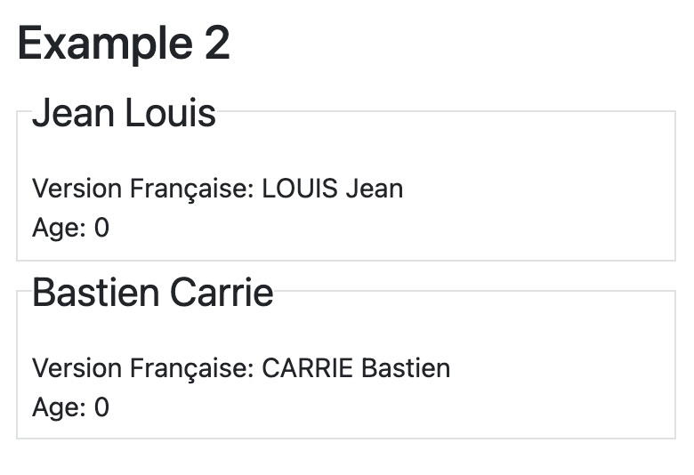

# evalvite --- a smaller, simpler data model for React

## Introduction

**Redux is too big and vastly too complex for what it does.** 

The React community need something _much_ simpler, and _much_ smaller.  
Redux is based
on a solid idea: make all the components of your app be data driven
for better modularity and easier testing.  But, over time, this 
well-intentioned idea has become lost in a maze of complexity.

Thus, _evalvite_.  evalvite is designed for typescript + React and assumes that you are
using class-based React components, not Functional Components (FCs). _If 
you want to use evalvite with FCs, see the help wanted section at the bottom._

If you don't agree that the list below is a set of problems, you can probably
stop reading now and return to reddit.

* Concepts you definitely need to understand to use Redux with React: 
  reducers, combining reducers, actions, action creators, dispatch, mapStateToProps,
  mapDispatchToProps, selectors, store, and async thunks.  Depending on your tooling
  and application you may also need to understand slices, middlewares [sic],
  enhancers, and immer.

* Redux's typings don't play nice with typescript.  They do _work_, but they are
  certainly not straightforward.  First, when you get an error in your editor, you'll
  notice that the tooltip that "explains" it covers half your screen and
  the content appears to be modem noise! This is because
  the type declaration(s) necessary to make Redux work with typescript are fiendishly
  complex.  Second, the use of HOC's, or _Higher Order Components_, via `connect()`,
  means that you have to understand _both_ the wrapper generated by redux-react
  via `connect()` _and_ how it relates to your code,
  the object _being wrapped_.  This has become such an issue that Redux Toolkit
  created `ConnectedProps` to try to ameliorate some of the problem.
  
* Redux's performance scales with the total size of store and number of
  reducers.  Redux passes all the actions to all reducers, thus guaranteeing
  all performance of all parts of the app is impacted by adding _any_ new reducer.  
  Put another way, once  your number of reducers and store gets big enough, 
  it doesn't matter what you do with Redux, it will be slow, even if the operation 
  you are doing is a simple as flipping a single boolean value.
  
* Redux's design for `<Provider>` pushes some part of the underlying data values
  in the store into props; `mapStateToProps()` controls the values your
  component sees.  The irony of the name of that function should not be lost.
  It is clear that the Redux store represents the _state_ of your app, yet the 
  fully-fledged React concept of "state" is ignored.

evalvite is based on the 1993 research paper by Scott Hudson.  We use the
all lowercase version of evalvite to indicate this software, we use the uppercase
version, EvalVite, to indicate the algorithm from the paper.  Although the
base algorithm used is the same as that explained in the paper, because your web
browser is not lazy, the benefits of the algorithm's laziness cannot easily
be exploited.  However, like EvalVite, evalvite is incremental in its evaluations;
incremental here means that the only parts of the data that are updated are those
affected by the change. In principle, EvalVite is minimal in the number of 
evaluations performed to keep all the data "up to date", although not in the 
amount of work done.

https://smartech.gatech.edu/handle/1853/3618

### Contrasts to Redux
If you agreed the list above was a set of problems worth solving,
here is a list of contrasts between evalvite and Redux:
* evalvite has a the concept of an attribute--a data value which
  is automatically maintained--and a model, which is a collection
  of attributes.
* evalvite is designed for typescript and all the type declarations
  make immediate sense, e.g. `Attribute<number>` or `Attribute<string>`.
* evalvite is incremental because of EvalVite.
* evalvite puts the value of the component's model in the component's
  "state".  This means that `render()` can simply consult `this.state`
  to do its work.
* No special shenanigans are required to work with asynchronous calls,
  such as fetching data from the network.  You can just handle the promises
  as you would expect, setting the values of attributes as needed.
  
## Using evalvite
The most important thing to understand is that you must 
* create a model for your data,
* tell evalvite about the model and what component displays the model's data.

evalvite guarantees that this model is up to date, and the current values from the model 
are automatically propagated to your component's `state` for use in
`render()`.

A model is composed of _attributes_ that are typescript generics wrapped around
a simple data value and anything else you want.  evalvite is careful
not to mess with things that are not attributes and thus non-attributes 
are _not_ automatically propagated to the component's state.

> All of the code for this example is in the evalvite distribution
> as `example2`.
> 

Here's an example, slightly simplified for clarity:
```typescript
import ev, {Attribute} from 'evalvite';

class myModel {
  firstName : Attribute<string>;
  lastName: Attribute<string>;
  age: number;
}

// you render from this
type myState = {
  firstName: string,
  lastName: string,
  age: number,  // needs to be manually updated, not an attribute!
}

// normal "top down" React data flow from parent to child
type myProps = {
  model: myModel,
}

// no HOC needed!
class MyComponent<myProps, myState> {
  // state needs to be initialized, but user will never see these values
  state: myState = {firstName:'',lastName:'',age:0};
  //...
}
```

At this point you have done the equivalent of these operations with Redux:
* defined the state for your component to work on 
* ~~defined your action(s)~~ (not nedeed!)
* ~~defined your mapDispatchToProps function~~ (not needed!)
* defined your reducer(s) (although in this trivial example, it is the identity reducer)

Having created your model, there are two more things to do with evalvite.

First, you have to "bind" your model to your component. This is roughly the
analogue of `mapStateToProps`, although it's probably better described as
"mapModelPropToState".  You do this in
your `componentDidMount()` method.  Continuing the example from above:

```typescript
class MyComponent<myProps, myState> {
  // ... see above ... 
  componentDidMount() {
    bindModelToComponent<myModel>(this.props.model,this);
  }
  // ...
}
```

The single line `bindModelToComponent...` tells evalvite that your model instance 
(`this.props.model` of type `myModel`) should update the `state` property of 
the given React component (`this`). 

## Computed attributes
The power of a data-driven model like Redux or evalvite is that you can derive
or _compute_ on one bit of data from another, and the infrastructure provided keeps things
up to date without you doing any work.  Let's define a silly, but demonstrative,
computed property.  To do this, we'll change our state and model slightly:

```typescript
// you render from this
type myState = {
  firstName: string,
  lastName: string,
  frenchLastName: string,
  age: number,  // remember, not maintained by evalvite
}

class myModel {
  firstName : Attribute<string>;
  lastName: Attribute<string>;
  frenchLastName: Attribute<string> = ev.computed<string>;
  age: number = 82;
  constructor(initialFirst:string, initialLast:string) {
    this.firstName.set(initialFirst);
    this.lastName.set(initialLast);
    this.frenchLastName = new ev.computed<string>(
      (confusingLastName:string)=> confusingLastName.toUppercase(), // note the 'get'!
      [this.lastName]
    );
  }
}
```
> In France, it's not necessarily clear if you should write your last (family) name
> first or your first (given) name first, thus on business cards and important 
> documents, the last name is fully capitalized.  For example, JEAN Louis is clear but
> Jean Louis is not.

You'll notice that there is a simple typescript function that is called whenever
the value of the `frenchLastName` is needed; this is usually called "demanding", "requesting",  or
"calling for" its value.  You'll notice that an array of references are provided as
the second parameter to the constructor.  These must be _exclusively_ other attributes
and they map one-to-one, in order, with the parameters to the given function.
If you were to pass non-attribute values into the function, you would asking for
trouble as your function for a computed attribute should be a pure function of its 
inputs.  (Using constants is ok, if you must.)


> Exercise for the reader #1 <br>
> Using example1 in the distribution, can you make it so Bastien
> is the son of Jean and was born when Jean was 23?  Thus, you should
> be able to set Jean's age (as an attribute!) and have Bastien's
> age computed automatically.
>```typescript
>this.frenchLastName.set('CHIRAC');  // or, worse, 'chirac'?
>```

You will notice from the constructor above that simple attributes, `firstName` and `lastName`, 
require you to call `set(value)` to change their
values. Similarly, you have to use `get()` to read the value of
a simple attribute.  This may seem annoying as you read this, but in practice
is little or no problem.  First, the `render()` function uses `this.state` for
display, and those are simple objects, not attributes.   Similarly, any function
that computes an attribute from other attributes, such as frenchLastName
above, will be given values not attributes.  Second, the typescript
compiler will barf on you if you attempt to access or change the value of an 
attribute without using `get()` or `set()`.  

> All of the code for this example with the checkbox is available
> in the evalvite distribution as `example1`.
> 


For example, this the change handler for a checkbox in some application.  The
checkbox controls the "important" attribute of this component's model:
```typescript
  change = ():void => {
    const {important} = this.props.model;
    important.set(!important.get());
  }
```

To repeat, your `render()` function should use the state, interactions with
the user should be changing values in the *model*.


> Exercise for the reader #2 <br>
> What will happen if you try to run this code?  What do you think
> _should_ happen?
>```typescript
>this.frenchLastName.set('CHIRAC');  // or, worse, 'chirac'?
>```

There are _no_ restrictions on where the input attributes to your computed attribute's 
function are from.  They just have to be attributes; naturally, you can compute computed
attributes from other computed attributes.  (Perhaps `chineseLastName` could
be derived from `frenchLastName` to display PinYin?)  It is customary to keep all the
app state together in a file called `store.ts` with a single Model called
`AppModel` that is used by your `<App/>` and whose various pieces are passed
down to the appropriate components, but that is mostly for laughs at
Redux's expense.  

With this in place, we can modify the `lastName` value and the change
will appear automatically when you request the value of `frenchLastName`.   
When you change a value, in theory, computations are not immediately done to
update the _dependent_ values.  Thus, if you repeatedly modify `lastName` in this
example, only the _last_ one will be used to compute `frenchLastName` when it
is finally requested and there is only a single call to the function that 
converts the text to uppercase.  Thus, the computation of `frenchLastName` is _lazy_.  In
practice, however, there are almost no situations  with React components 
where this benefit can be reaped.  (The React rendering model depends
heavily on `render()` being a simple, pure function of props and state,
and thus the state must be available before `render()` is called and
evalvite has no way of knowing if `render()` _will_ be called.  If you wanted to be
more "lazy" you could move the state updating part of evalvite into the
`render()` path--"just in time" state computation--but this has not been done as 
it seems antithetical to the React philosophy.)

### Rendering
Your `render()` function should exclusively use the state defined when
you created your component and of course whatever props have been provided.

**You are now done with all you need to learn.  You can go forth and hack.**

## Minor notes on models
Your model should be a type with fields.  Thus, this model is not valid:
```typescript
type myModel = ev.simple<number>;
```
This would have to be written as:
```typescript
type myModel = {
  someField: ev.simple<number>,
}
```
The reason for this restriction is that React defines its state variable as
single-level object.  Since we push the values of the model's fields into state
with the same names, we constrained by React's choice.

It is customary to just use simple values in the model, rather than trying 
use the modifiers `public`, `private`, etc.  Although this is possible (see
"Using a class as an interface" in the typescript docs), it seems like overkill.

## A fun example
Since we've shown you how props, state, and model are related above, so
we'll just show you a model here:

```typescript
type Age = {
  name: string, 
  years: ev.simple<number>,
  alive: ev.simple<boolean>,
}

class myModel  {
  values: ev.array<Age> = new ev.array<Age>();
  oldestLiving: ev.computed<number>;
  constructor() {
    this.oldestLiving = new ev.computed((ages: Age[])=>{
      let result = -1; // -1 means nobody is alive
      for (let i=0; i<ages.length; i=i+1) {
        if (ages[i].alive && ages[i].years>result) {
          result = ages[i].years
        }
      }
      return result
    }, [this.values]);
  }
}

```
This example shows how to use an `ev.array` attribute.  This attribute contains
the entire array of `Age` types.  If there are changes to either the number of elements
in the array, or the values of the attributes on Age within any member of the array,
you will get a correct result when you request `oldestLiving`.  It's worth noting
that as shown above, changes that are made to the `name` field of any member of the
array do *not* cause any change in the value of oldestLiving.  Just because 
grandma got married at 90 and changed her name, it doesn't change the oldest
living member of the family.

Typically, you'll want an array of models or submodels, as you see in this
example.  In rare cases, you may want _NaiveArrayAttribute_ (created with `ev.naive()`)
which is an array of simple values.  This is called naive because when elements
are modified, values dependent on the NaiveArrayAttribute are not recomputed.
Only when the number of elements in the array changes are values that are
computed from a NaiveArrayAttribute adjusted.

# Help Wanted
These are a few items that somebody with a particular set of expertise could
probably fix, but I could not.

* `typescript type system` The `state` type is closely related to the model, 
  differing only in that the attribute values are "pulled out" of the attributes.
  Can we automatically create the state definition from the model definition?
  Can we statically guarantee the types and the number/name of the fields in
  the state var?
  
* `typescript type system` Can we statically check at compile time that the parameters
  to a function used in a computed attribute are correct?  Since we know the types,
  it seems like this should be possible.

* `typescript type system` It is tedious to have to add this _index signature_ line to every model,
  can it be removed by changing the types somehow?.
```typescript
interface someModel{
  [key:string]:any;
}
```

* `react` At the moment evalvite only works with class-based components.  I am
  just not sufficiently well-versed in how functional components--and their
  brothers, hooks--work to make evalvite work properly with such components. If
  you are familiar enough with how to construct the glue make evalvite to
  functional components, please open a pull request!
  
